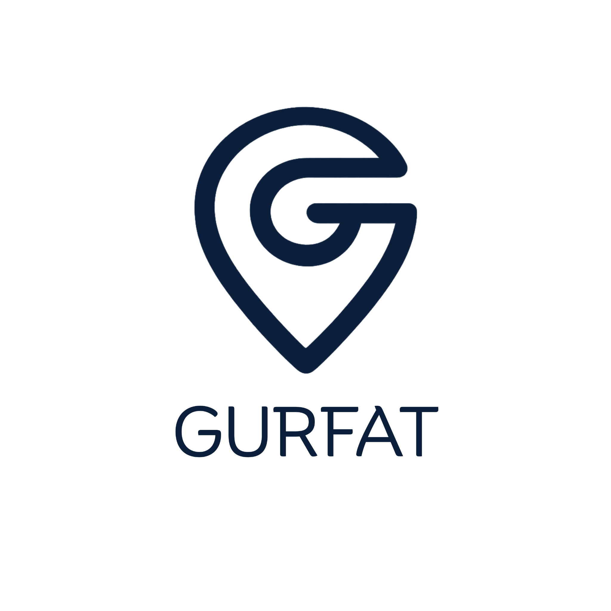

<!DOCTYPE html>
<html lang="en">
<head>
<meta charset="UTF-8">
<meta name="viewport" content="width=device-width, initial-scale=1.0">
<title>Gurfat | Premium Rentals in Bahrain</title>

<link rel="icon" href="./assets/favicon.ico">
<link rel="stylesheet" href="./brand/brand.css">

<link href="https://fonts.googleapis.com/css2?family=Inter:wght@400;500;700;800&display=swap" rel="stylesheet">

</head>
<body>

<header>
  

    
    

      <a href="#">Listings</a>
      <a href="#">Destinations</a>
      <a href="#">Landlords</a>
      <a href="#">Contact</a>
      <a href="#" class="btn btn-primary">List Property</a>
    

  

</header>

<section class="hero">
  

    <h1>Premium Rentals. Seamlessly Managed.</h1>
    
Effortless property management and luxury stays across Bahrain.

    <a href="#" class="btn btn-primary">Explore Listings</a>
  

</section>

<section class="section">
  

    <h2>Our Services</h2>
    

      

        <h3>Full Property Management</h3>
        
From guest communication to maintenance, we handle everything for Bahrain property owners.

      

      

        <h3>Guest-Ready Apartments</h3>
        
Professionally prepared, fully furnished homes ready for short-term stays.

      

      

        <h3>Smart Pricing Engine</h3>
        
Optimized pricing for F1 weekends, peak seasons and high-demand periods.

      

    

  

</section>

<section class="section gurfat-cta">
  

    <h2>Own a Property in Bahrain?</h2>
    
Turn your apartment into passive income — fully managed by Gurfat.

     
    <a href="#" class="btn btn-secondary">Join as Landlord</a>
  

</section>

<section class="section">
  

    <h2>Serving Bahrain’s Top Locations</h2>
    

      
<h3>Seef District</h3>

      
<h3>Bahrain Bay</h3>

      
<h3>Marassi Al Bahrain</h3>

      
<h3>Juffair</h3>

    

  

</section>

<footer>
  

    © 2026 Gurfat. All rights reserved.  
    Premium Rentals in Bahrain.
  

</footer>

</body>
</html>
